# VoiceMind: A Voice-Based Agent AI Companion for Mental Health Support — Project Diagrams

> All diagrams use [Mermaid](https://mermaid.js.org/) syntax. Render in any Markdown viewer with Mermaid support (GitHub, VS Code with Mermaid extension, etc.).

---

## 1. System Architecture (High Level)

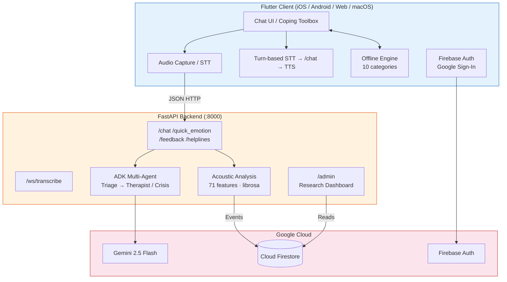

---

## 2. Audio Pipeline Flow

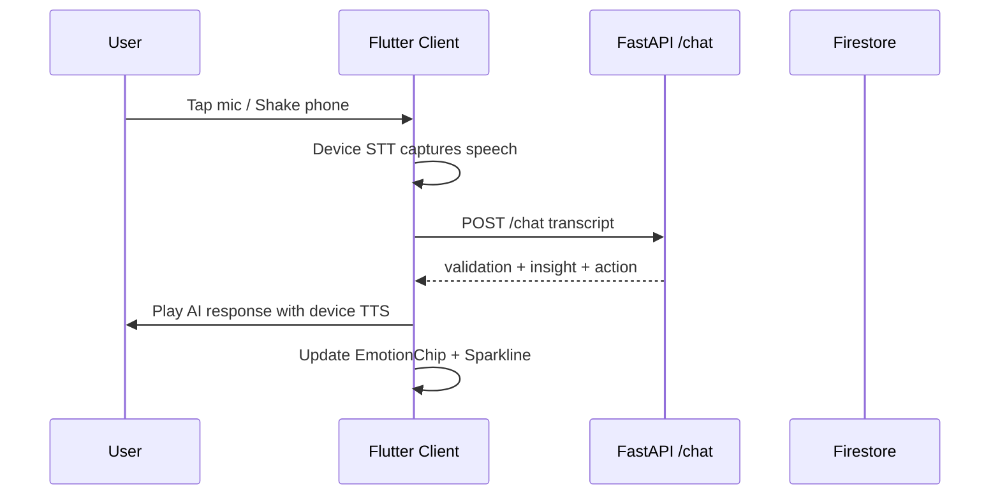

---

## 3. Crisis Detection — 3-Tier Architecture

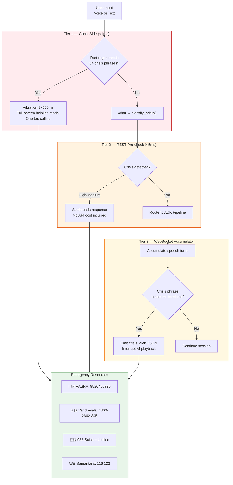

---

## 4. ADK Multi-Agent Pipeline

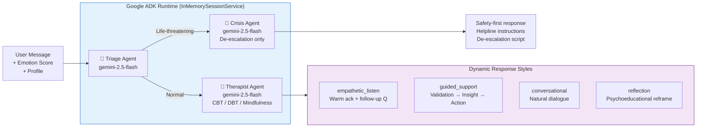

---

## 5. Dual-Channel Emotion Fusion

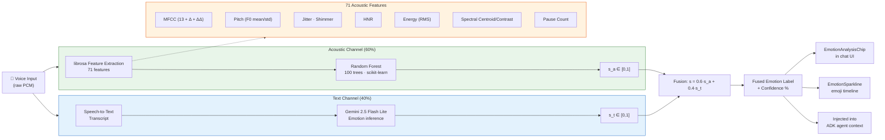

---

## 6. User Journey / App Flow

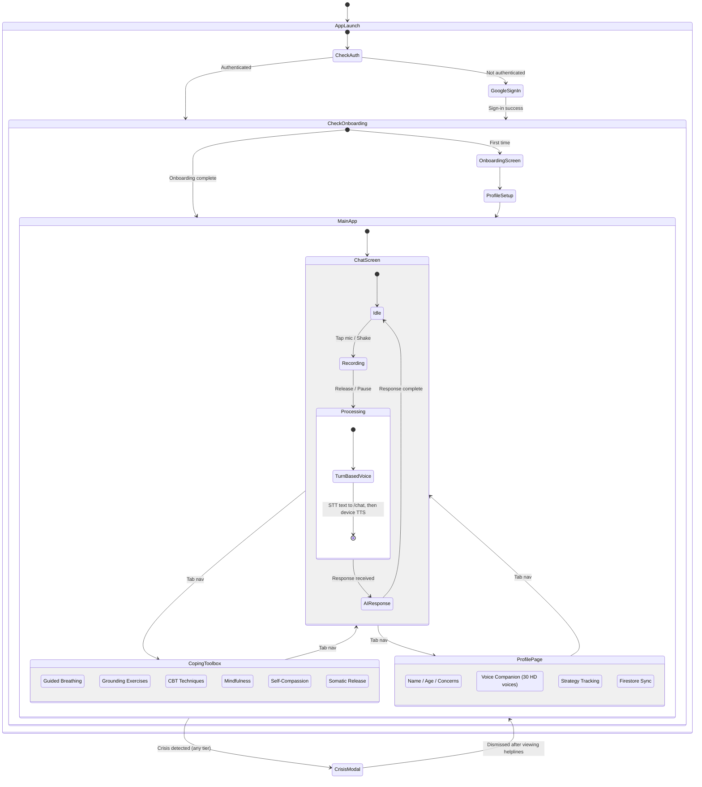

---

## 7. Admin Research Dashboard — Data Flow

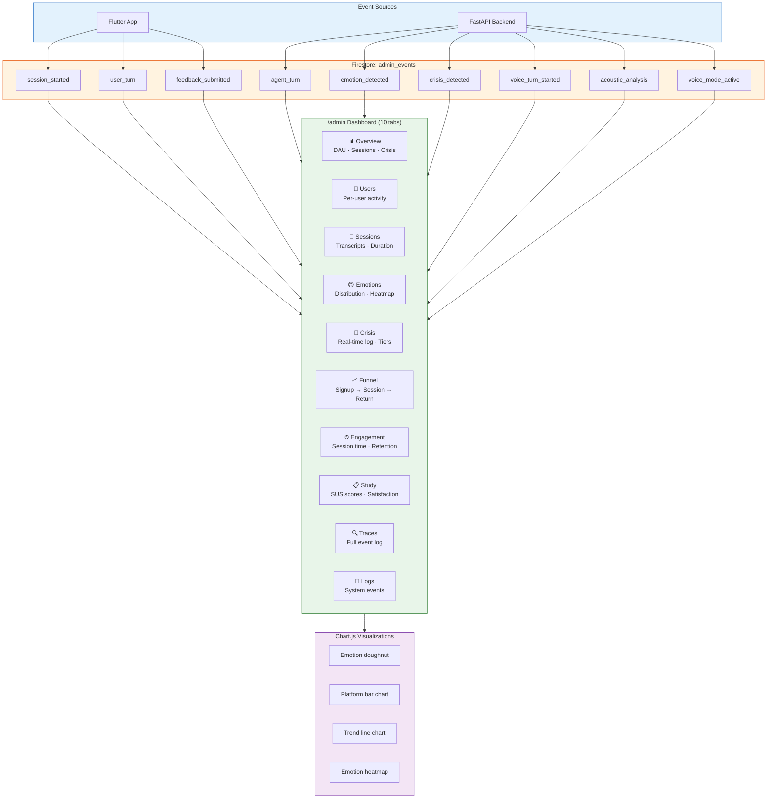

---

## 8. Firestore Data Model

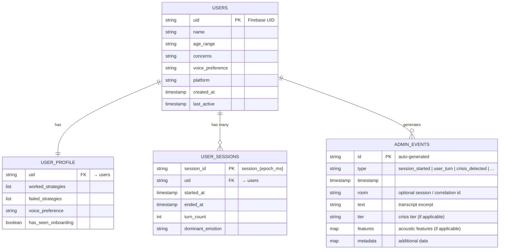

---

## 9. Offline Coping Engine

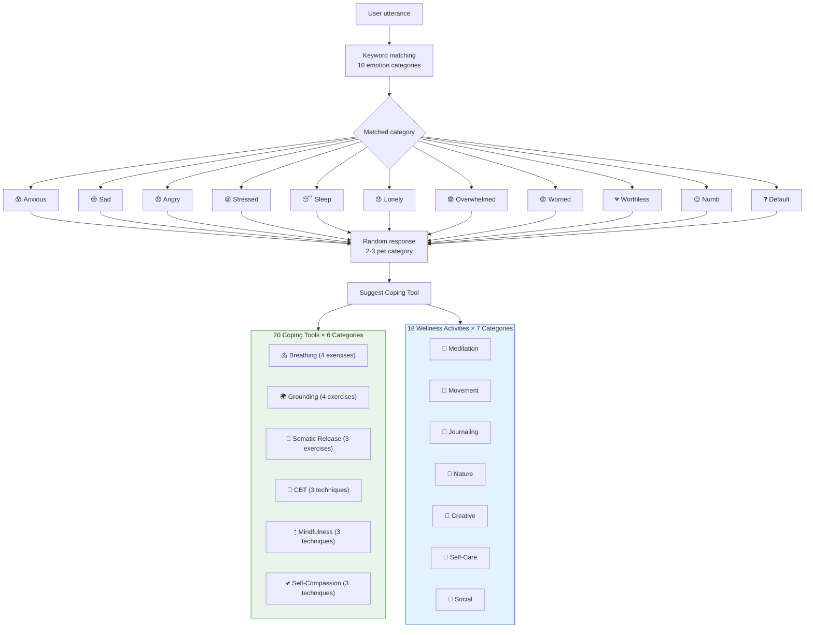

---

## 10. Test Architecture

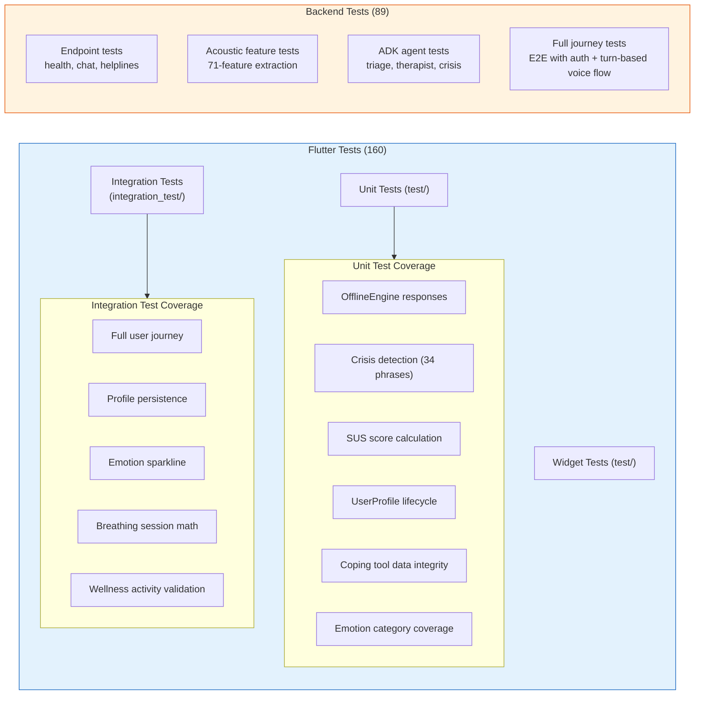

---

## 11. Deployment Architecture

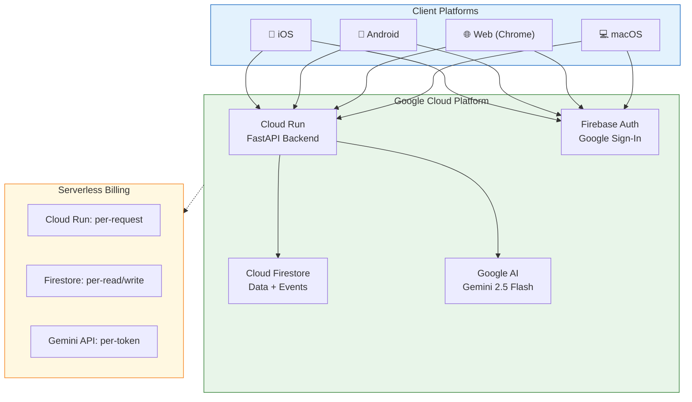

---

## 12. Research Contribution Mapping

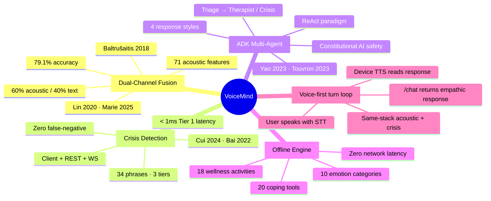
