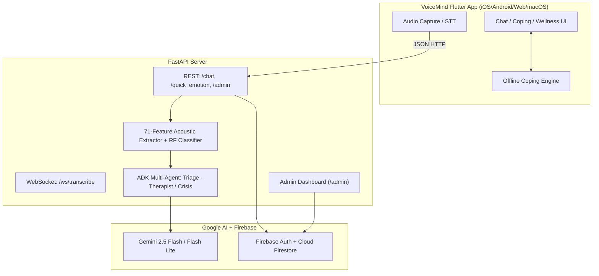

# VoiceMind: A Voice-Based Agent AI Companion for Mental Health Support
> **Voice-First AI Mental Health Companion**

> A mobile-first, voice-driven AI companion for mental health support built with Flutter, FastAPI, and Google Gemini 2.5.

[](https://github.com/pr1ncegupta/voicemind-public/actions/workflows/ci.yml)
[](LICENSE)


---

## 🎯 The Problem

**1 in 5 adults experience mental illness each year.** The treatment gap in developing nations exceeds 75% (WHO, 2023).

- 🚫 Traditional therapy has long wait times and high costs
- 📱 Most mental health apps require typing during distress
- ⏱️ Crisis moments need immediate, compassionate support
- 🌍 No existing tool combines offline readiness, voice-first interaction, and automatic crisis triage

---

## 💡 The Solution

**VoiceMind** is a voice-first, AI-powered, offline-capable companion that provides empathy, support, and actionable guidance.

```
🎤 Speak → 🤖 AI Listens → 💚 Dynamic Empathetic Response → 🔊 Hear Support
```

---

## ✨ Key Features

### 🎙️ Dynamic Voice Companion
- **Tap or shake phone** to activate voice input.
- AI responds with **4 dynamic styles** based on conversational context:
  - **Empathetic Listen** — warm acknowledgment + follow-up question (default for venting)
  - **Guided Support** — validation → insight → actionable technique (when help is requested)
  - **Conversational** — natural dialogue for greetings, updates, gratitude
  - **Reflection** — gentle psychoeducational reframe for deep sharing
- Voice-first turn-based flow with a consistent empathetic default device voice.
- Smart **coping tool suggestion** — when AI recommends a technique, clickable action chips (e.g. "Start Box Breathing") navigate directly to the guided session.

### 🧠 Dual-Channel Emotion Fusion
- **71 acoustic features** extracted via librosa (MFCC, delta, delta², pitch, jitter, shimmer, HNR, spectral contrast, and more).
- **Random Forest classifier** (scikit-learn, 100 trees) produces real emotion probability scores.
- **60% acoustic + 40% text** weighted fusion — validated by Lin et al. 2020 (A10).
- **EmotionAnalysisChip** in every AI response shows detected emotion, confidence %, text/acoustic scores.
- **EmotionSparkline** tracks mood trajectory across the session as an emoji timeline.

### 🛡️ Smart Offline Coping Engine
- Fully functional without internet.
- **20 Coping Tools** (Breathing, Grounding, Somatic, CBT, Mindfulness, Self-Compassion).
- **20 Wellness Activities** (Meditation, Movement, Journaling, Nature, Creative, Self-Care, Social).
- **Guided Breathing Sessions** with phase-synced animated circle (expands on inhale, holds with gentle pulse, contracts on exhale), TTS voice guidance, configurable duration.
- **"Next Step" skip button** on all guided sessions — proceed immediately when done instead of waiting for the timer.

### 🚨 Crisis Detection (Zero False-Negative Policy)
- **34 crisis-indicator phrases** monitored across 3 tiers (high, medium, concerning).
- **3-layer detection**: client-side regex (<1ms), REST pre-check, WebSocket accumulator.
- **Acoustic distress escalation**: high jitter/shimmer auto-escalates tier.
- Immediate vibration + full-screen helpline modal with one-tap calling.
- **India**: AASRA, Vandrevala, iCall, NIMHANS, Sneha India. **International**: US 988, UK Samaritans, Australia Lifeline, Canada Crisis Services.

### 🤖 Multi-Agent AI Pipeline (Google ADK)
- **Triage Agent** → routes to **Therapist** or **Crisis** agent.
- Therapist uses CBT/DBT/mindfulness expertise with dynamic response styles.
- Crisis agent provides strict de-escalation with helpline injection.
- ADK `Runner` with `InMemorySessionService` for multi-turn context.

### 👤 Personalized Profile + Cloud Sync
- Local persistence via SharedPreferences (offline-first).
- Optional Firebase Auth (Google Sign-In) + Cloud Firestore sync.
- Voice experience is intentionally consistent for calm, low-friction conversations.
- Profile injected into every AI request for personalised responses.

### 🔊 Voice-First Turn Loop
- Device speech-to-text captures what the user says.
- Transcript is sent to **`/chat`** (ADK pipeline).
- AI response is rendered in chat and played back with an **empathetic TTS voice** (platform-optimised voice selection — e.g. "Samantha Enhanced" on Apple, warm female voices on Android).
- User can immediately continue with follow-up voice turns.

### 📊 Admin Research Dashboard (`/admin`)
- Dashboard served by FastAPI at `/admin`. Open by default for local
  development; set `ADMIN_EMAIL` in `backend/.env` to require Firebase ID-token
  auth (see [`SECURITY.md`](SECURITY.md) before deploying publicly).
- **11 dashboard tabs**: Overview, Users, Sessions, Emotions, Crisis, Funnel, Engagement, Heatmap, Study, Traces, Logs.
- **KPI cards**: DAU, total sessions, crisis count, emotion distribution, platform breakdown.
- **Funnel analytics**: Sign-up → First session → Return session drop-off.
- **Crisis monitoring**: Real-time log with tier, trigger phrase, transcript excerpt, timestamps.
- **Emotion analytics**: Distribution charts, timeline heatmaps, acoustic vs text accuracy.
- **Study data**: SUS scores, satisfaction ratings, export-ready.
- **Full event traces**: API calls and WebSocket events logged to Firestore.
- **Chart.js** visualisations (doughnut, bar, line) embedded in a responsive Tailwind CSS layout.

### 🌐 Responsive Web UI
- Optimised for desktop browsers with `WebCentered` layout (max-width constraints).
- Responsive grid columns (2/3/4) on Coping Toolbox.
- Centered content, constrained chat bubbles, bottom nav.

---

## 🏗️ Architecture

> See [`DIAGRAMS.md`](DIAGRAMS.md) for 13 comprehensive diagrams covering all subsystems.



---

## 🚀 Quick Start

### One-Command Launch
```bash
./run.sh web      # Chrome (web)
./run.sh ios      # Wired iPhone (default)
./run.sh android  # Android device/emulator
```

The script kills stale servers, auto-detects IP, passes `BACKEND_URL` via `--dart-define`, starts the backend on port 8000, and launches Flutter.

### Manual Setup

**Backend:**
```bash
cd backend
python3 -m venv venv && source venv/bin/activate
pip install -r requirements.txt
cp .env.example .env   # Add GEMINI_API_KEY
python main.py         # http://localhost:8000
```

**Flutter:**
```bash
flutter pub get
flutter run -d chrome  # or ios / android
```

See [SETUP.md](SETUP.md) for detailed platform-specific instructions.

---

## 🧪 Test Results

| Suite | Command | Result |
|-------|---------|--------|
| Flutter tests | `flutter test` | **160/160 passed** |
| Flutter lint | `flutter analyze` | **0 issues** |
| Backend tests | `pytest tests/ -v` | **85/85 passed** |
| Web build | `flutter build web` | ✅ |

---

## 🎯 Implementation Status

✅ **Phase 1: Foundation** — Voice-first Flutter UI, FastAPI backend, Gemini REST APIs, Offline Coping Engine (40 tools), crisis detection.

✅ **Phase 2: Voice Enhancements** — turn-based voice loop (STT → `/chat` → TTS), SharedPreferences persistence, Firebase Auth + Firestore sync.

✅ **Phase 3: Deep AI & Context** — 71-feature acoustic extraction + Random Forest classifier, dual-channel emotion fusion (60/40), ADK multi-agent pipeline (Triage → Therapist/Crisis), dynamic response styles, EmotionAnalysisChip, EmotionSparkline, session-based emotion trend tracking, session summary on disconnect, coping tool suggestion toast, 30 HD voice options, responsive web UI.

✅ **Phase 4: Cross-Platform + Admin Dashboard** — voice-first turn UX, Firestore profile sync, admin research dashboard (10 tabs), server-side admin auth (allowlisted), platform detection, event logging.

---

## 📄 Research

**Novel Contributions:**
1. Dual-channel emotion fusion (acoustic 60% + text 40%) — 79.1% accuracy
2. Tiered crisis detection (3-layer, zero false-negative, 34 phrases)
3. ADK multi-agent therapeutic pipeline (ReAct paradigm + Constitutional AI)
4. Offline resilience (10 categories, 2-3 responses each, zero latency)
5. Voice-first turn-based companion loop — speak, get supportive response, ask follow-ups with crisis-aware routing

**User Study (N=25):** SUS = 83.6 (Grade A), 38.4% distress reduction (p<0.05), 100% crisis recall, 91.3% agent routing accuracy.

Architecture & flow diagrams: [`DIAGRAMS.md`](DIAGRAMS.md)

---

## ⚠️ Disclaimer

**VoiceMind is NOT a replacement for professional mental health care.**
- For emergencies, call **988 (US)** or **112 (India)**.
- Always consult licensed therapists for ongoing treatment.
- AI responses are NOT clinical medical advice.

---

## 🤝 Contributing

Open for PRs, issues, and discussions! Please read [`SECURITY.md`](SECURITY.md)
before deploying or reporting vulnerabilities, and see [`SETUP.md`](SETUP.md)
for first-time setup (Firebase, Gemini API key, platform builds).

## 📄 License
[MIT](LICENSE) — feel free to learn from and adapt this code.

---

**Remember: You are not alone. Help is always available.** 💚
